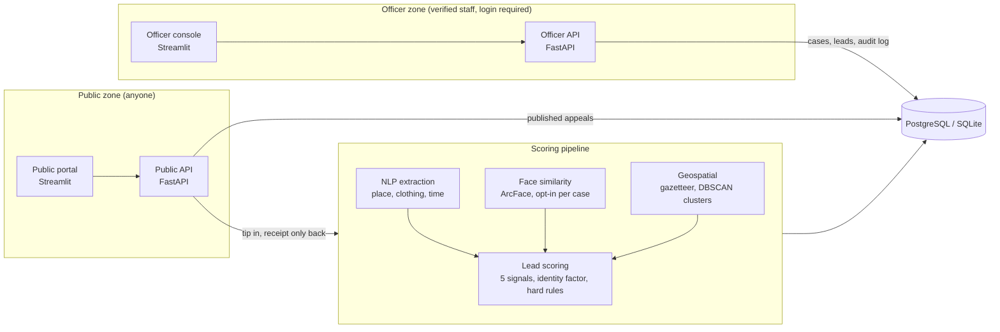

# TraceAI

[](https://github.com/GopikaJaideep/TraceAI/actions/workflows/ci.yml)

AI-assisted missing-person investigation **support** platform for Australian contexts. **Police and
partner agencies** review and prioritise leads; **the general public** can only read published appeals and
submit tips.

**[Live demo](https://gopikajaideep.github.io/TraceAI/)** · **[Design decisions and ethics](docs/design-decisions.md)** · [Results](#results)

> **Research prototype.** Public research datasets and synthetic profiles only. No real cases, no real
> CCTV or personal data. It is an investigative support tool, not an identification system. Do not point it
> at real data until the "Before real use" list below is done.


| Public portal | Admin and audit log |
|---|---|
|  |  |

Screenshots use placeholder avatars: the test photos (LFW) are real people, so they are never published.

## Architecture



The two zones are **separate processes**: the public app does not contain the officer routes at all, so it
cannot leak them through a bug or misconfiguration.

| | Public zone | Officer zone |
|---|---|---|
| Who | Anyone | Verified police / NGO staff |
| App | `traceai.api.public_app` (8020) + `public_portal/` (8502) | `traceai.api.officer_app` (8010) + `dashboard/` (8501) |
| Can do | Read appeals an officer published; submit a tip | Open and close cases, review leads, see the map, manage users (admin) |
| Sees | City-level location, photo and summary an officer chose to publish | Only the cases they were granted |
| Gets back from a tip | A random receipt reference. Never a score, a match or a case | Ranked leads with a per-signal breakdown |

## How leads are scored

| Module | Approach |
|---|---|
| Vision | InsightFace / ArcFace embeddings, cosine similarity between a case photo and a tip photo |
| NLP | Extracts place (Australian gazetteer), clothing and time from free text; optional spaCy NER; hedging and certainty cues feed credibility |
| Geospatial | DBSCAN (haversine) clusters of strong sightings and an inferred movement corridor |
| Lead scoring | Weighted image, description, proximity, recency and credibility. Missing signals are dropped and weights renormalised. Identity evidence (face or description) scales the result. Impossible journeys and sightings that predate the last-known time score 0 |

## Results

`python -m scripts.evaluate` ranks 42 sightings per case, of which 3 are true sightings of that case's
person (a different photo of the same identity, degraded to mimic another camera). Random ordering gets
precision@3 of about 0.07. 30 cases per setting (5 seeds × 6 identities), InsightFace `buffalo_sc`. "±" is the
standard deviation across cases, so each mean has a standard error of roughly a fifth of that.

**Standard setting**: decoys wear a different outfit or hedge their wording.

| Ranking method | Precision@3 | Top-1 correct | MRR | AUROC |
|---|---|---|---|---|
| Random ordering (expected value) | 0.07 ± 0.14 | 0.07 | 0.21 | 0.50 |
| Proximity to last-known place only | 0.68 ± 0.25 | 0.80 | 0.88 | 0.98 |
| Text, place, time and credibility (no face) | 0.91 ± 0.17 | 1.00 | 1.00 | 1.00 |
| Face similarity only | 0.68 ± 0.06 | 1.00 | 1.00 | 0.83 |
| **TraceAI: all signals fused** | **0.94 ± 0.12** | 1.00 | 1.00 | 1.00 |

The report templates and the extraction rules were written together, so text alone already does well and
fusion adds little: 0.91 to 0.94 is within the noise. This setting cannot show what combining signals is for.

**Photo availability: the fair test.** Decoys have the same outfit, the same confident wording, and the
same places and times as true sightings (`--setting photo-rate`), so text cannot separate them. Every tip,
true or decoy, then keeps its photo with the probability shown, **independent of whether it is a true
sighting**. Most real tips will not have a photo, so this is the question that matters.

| Tips with a photo | Text only (no face) | Face only | **All signals fused** | Fused: top-1 correct |
|---|---|---|---|---|
| 20% | 0.49 ± 0.22 | 0.22 ± 0.18 | **0.62 ± 0.22** | 0.73 |
| 50% | 0.50 ± 0.21 | 0.54 ± 0.28 | **0.81 ± 0.20** | 0.93 |
| 100% | 0.49 ± 0.22 | 1.00 ± 0.00 | **1.00 ± 0.00** | 1.00 |

Precision@3, random ordering is 0.07. Full tables for each rate are in `docs/eval.json`.

**How to read this honestly.**

- **Text alone sits at about 0.5 in every row.** With look-alike decoys it is at chance among the six
  candidates (3 true, 3 decoys), by construction.
- **Fusion beats both single signals when photos are scarce or mixed:** 0.62 against 0.49 and 0.22 at 20%,
  0.81 against 0.50 and 0.54 at 50%. Face alone cannot rank a tip that has no photo, and text alone cannot
  tell look-alikes apart. Fused ranking uses text to lift the look-alike group above the unrelated tips and
  the face to choose within it. The gaps are several standard errors (each mean's is about 0.04).
- **At 100% the face alone is already perfect.** Synthetic frontal photos of public figures are easy for
  the face model, so 1.00 is a ceiling from easy data, not a claim.
- **Low photo rates are limited by information, not only by method.** A true sighting with look-alike text
  and no photo has nothing that separates it from a photo-less decoy, so no ranking could do much better
  without more signals.
- **It is synthetic throughout:** reports and extraction rules written together, invented profiles, 30
  cases per setting. Do not read any row as real-world accuracy.

**Hard setting (kept for comparison, not for the headline).** The same look-alike decoys as above, but every
decoy carries a photo while one true sighting per person does not.

| Ranking method | Precision@3 | Top-1 correct | MRR | AUROC |
|---|---|---|---|---|
| Random ordering (expected value) | 0.07 ± 0.14 | 0.07 | 0.21 | 0.50 |
| Proximity to last-known place only | 0.39 ± 0.17 | 0.43 | 0.68 | 0.94 |
| Text, place, time and credibility (no face) | 0.48 ± 0.24 | 0.40 | 0.65 | 0.95 |
| Face similarity only | 0.68 ± 0.06 | 1.00 | 1.00 | 0.83 |
| TraceAI: all signals fused | 0.96 ± 0.11 | 0.97 | 0.98 | 1.00 |

Its 0.96 is inflated. Mismatched faces push the photo-bearing decoys down while the photo-less true
sighting is not penalised, so the fused ranking looks better than it should. That bias is why the photo
availability test above exists; its numbers at realistic photo rates (0.62 and 0.81) are the ones to quote.

**How the benchmark changed.** Earlier versions had two flaws that flattered the results (a decoy could
reuse another case's face, and hard-setting decoys were easier to place than true sightings). Both are fixed
and the run asserts the first cannot recur. The hard setting's photo bias was found afterwards and is
addressed by the photo-availability test. Each fix lowered the published numbers.

Numbers are also on the [demo site](https://gopikajaideep.github.io/TraceAI/#results) and in
`docs/eval.json`.

## Misuse safeguards (what the code enforces)

| Risk | Control | Where |
|---|---|---|
| Stalking a person who fled an abuser, via a "missing" report | Cases only from an officer, with a police reference **and** a family-violence / protection-order screening attestation; the public never searches, sees matches or sees exact locations | `cases.create_case`, `public_app` |
| Someone probing the tip form to locate a person | Tip response is a receipt only; tipsters are never told whether anything matched | `public_app.submit_tip` |
| Fake or malicious tips | Rate limits (5 per 10 min, 20 per day per source), consent + false-report notice, honeypot field (enforced by the API; the bundled Streamlit form does not include it), tips from one source (3+ in 24 h) or identical text from several sources are **flagged** for reviewers; a tip never triggers action, it only joins a review queue | `public_app`, `ratelimit` |
| Malicious uploads / location leaks | Files are verified as real JPEG/PNG, decompression-bomb limited, size limited, re-encoded (EXIF and GPS dropped) and stored under random names | `images.store_image` |
| Insider snooping | Need-to-know per case (other officers and even admins get 404), every read and change logged in a hash-chained audit log, reading the audit log is itself logged | `security.case_for_user`, `audit` |
| Weak accounts | scrypt password hashing, 12+ character minimum, lockout after 5 failures, one message for every login failure, login rate limit, expiring signed tokens, no default credentials (the seed script prints random ones once) | `security` |
| Face-matching abuse | Off unless the officer attests the photo was lawfully obtained; a tip's photo is only turned into a face embedding if at least one open case has matching authorised; results are similarity scores for human review, never names | `cases`, `pipeline` |
| Data kept forever | Closing a case deletes its photo, face embedding and leads; public tips expire after 90 days unless an officer marked one useful (`python -m scripts.purge`) | `cases.close_case`, `purge_expired_tips` |
| Source tracing | Tipster IPs are stored only as a keyed hash, never raw | `security.source_hash` |

The reasoning, the alternatives I rejected and the risks I could not remove are in
[docs/design-decisions.md](docs/design-decisions.md).

## Before real use (not done, and not something code alone can do)

- **Legal and privacy:** biometric data is sensitive information under the Privacy Act 1988; get a privacy
  impact assessment and legal advice, and agree governance with the police agency that owns the cases.
- **Identity:** replace the built-in login with the agency's SSO and MFA. Verify tipsters' phone or email if
  you want stronger fake-report resistance.
- **Infrastructure:** TLS everywhere, the officer zone reachable only from the agency network/VPN, a WAF or
  edge rate limiter (the built-in limiter is per process), encryption at rest, backups, and a real
  `X-Forwarded-For` policy behind your proxy.
- **Audit:** ship the audit log to write-once storage. The hash chain detects edits; it cannot stop someone
  with database admin rights from rewriting the whole chain.
- **Accuracy and fairness:** measure face-matching and lead-ranking error rates, including across
  demographic groups, on data that resembles reality.
- **Model licensing:** the InsightFace pretrained models are for non-commercial research use only, so
  production use needs different models or permission from their owners (see the licence table below).
- **Assurance:** independent security testing and an ethics review.

## Run locally

```bash
python -m venv .venv
.venv/Scripts/pip install -r requirements.txt   # Windows; use .venv/bin on Linux/macOS
.venv/Scripts/python -m spacy download en_core_web_sm

# Seed synthetic data (first run downloads LFW, ~230 MB, and the face model). Prints login credentials once.
TRACEAI_FACE_MODEL=buffalo_sc .venv/Scripts/python -m scripts.seed --reset

export TRACEAI_SECRET_KEY=$(python -c "import secrets;print(secrets.token_urlsafe(48))")
TRACEAI_FACE_MODEL=buffalo_sc .venv/Scripts/python -m uvicorn traceai.api.officer_app:app --port 8010
.venv/Scripts/python -m uvicorn traceai.api.public_app:app --port 8020
TRACEAI_API_URL=http://localhost:8010 .venv/Scripts/python -m streamlit run dashboard/app.py --server.port 8501
TRACEAI_PUBLIC_API_URL=http://localhost:8020 .venv/Scripts/python -m streamlit run public_portal/app.py --server.port 8502
```

- Officer console: http://localhost:8501 (sign in with the seeded `officer` or `admin` credentials).
- Public portal: http://localhost:8502.
- Run the Streamlit apps from the repo root: they read `.streamlit/config.toml`, which hides Streamlit's
  developer toolbar (the Deploy button and menu) from end users.
- If `TRACEAI_SECRET_KEY` is unset a throwaway key is used and sessions end whenever the API restarts.
- `TRACEAI_FACE_MODEL`: `buffalo_l` (default, most accurate, ~280 MB) or `buffalo_sc` (~15 MB).
- `TRACEAI_FACE_BACKEND=none` disables image scoring. `DATABASE_URL` defaults to SQLite in `data/`.
- Changing the schema needs `--reset` (there are no migrations yet), which wipes the database.

## Docker

```bash
POSTGRES_PASSWORD=... TRACEAI_SECRET_KEY=... docker compose up --build
```

Public services are published on 8020 and 8502; officer services bind to `127.0.0.1` only. The
[CI workflow](.github/workflows/ci.yml) builds the images and smoke-tests the whole stack against
PostgreSQL on every push: all four services come up, the zone boundaries hold (officer routes return 401
without login and do not exist on the public app), and a case, a public tip and the officer's analysis
round-trip through the database. If you would rather not use Docker, the manual path above works.

## Tests and CI

```bash
.venv/Scripts/python -m pytest -q tests           # 48 tests, through the real HTTP layer
.venv/Scripts/python -m scripts.mutation_check    # breaks 10 safeguards one at a time; the tests must fail each time
```

CI runs the tests on Python 3.12 and 3.13 (the minimum is 3.12, because the pinned numpy no longer supports
3.11), runs `mutation_check` (so "each safeguard was verified by
breaking it" is reproducible rather than a claim), and runs the Docker smoke test.

## Reproducing the screenshots and results

```bash
python -m scripts.evaluate --seeds 5 --setting standard   # also: --setting hard, and
python -m scripts.evaluate --seeds 5 --setting photo-rate --photo-rates 0.2 0.5 1.0
python -m scripts.export_demo                             # data for the demo site
python -m scripts.make_screenshot_data                    # photo-free database copy
python -m scripts.capture_screenshots                     # needs: pip install playwright
```

## Limitations

- The gazetteer is about 50 well-known places with approximate coordinates, not the full OpenStreetMap or
  ASGS extracts. `gazetteer.resolve` and `nearest` are the interface a full version would keep.
- Market-1501 is not used (it needs a Kaggle login). Cross-camera sightings are simulated by augmenting
  LFW images.
- Lead scores are heuristic and uncalibrated. Weights are in `traceai/scoring.py`.
- The Streamlit public form has no honeypot field (the API supports one for custom front ends).
- No database migrations; no MFA; in-memory rate limits.

## Licences and data terms

TraceAI's own code is under the [MIT licence](LICENSE). It uses third-party models, data and libraries with
their own terms. This is a summary, not legal advice: check the current terms before reusing anything.

| Component | Terms | What it means here |
|---|---|---|
| **InsightFace pretrained models** (`buffalo_l`, `buffalo_sc`) | Non-commercial research use only, per the InsightFace project | Fine for this research prototype. Any commercial or production use needs separate permission from the model's owners. The models are downloaded at runtime, not shipped in this repo. |
| **LFW face dataset** | A research dataset of photos of public figures; see its own terms | Downloaded through scikit-learn and never committed. It is used only to test matching, and its photos never appear in published screenshots or the demo site. |
| **OpenStreetMap** data and tiles | ODbL, attribution required | The demo map credits OpenStreetMap contributors. The public tile server is meant for light use, so a real deployment needs its own tile source. |
| **Python libraries** | Mostly MIT, BSD or Apache-2.0 (FastAPI, SQLAlchemy, Streamlit, PyTorch, spaCy, scikit-learn and others) | `psycopg2` is LGPL. |
| **Leaflet** (demo site) | BSD-2-Clause | Loaded from a CDN. |
| **Profiles and reports** | Invented for this project | No real people, cases or reports. |

## Dependencies

Direct dependencies are pinned in `requirements.txt` (runtime) and `requirements-ci.txt` (the lean set CI
uses) to the versions the tests and evaluation were run with, and the Docker image pins PyTorch too. That
makes builds repeatable, but transitive dependencies are still resolved by pip, so it is not a full lock
file (`pip-compile` with hashes would be the next step). Pinned versions also go stale, so they need
updating from time to time.

## Data

Faces: [LFW](https://www.kaggle.com/datasets/jessicali9530/lfw-dataset) via scikit-learn. All profile
details (names, ages, clothing, last-known places, police references) are invented.
