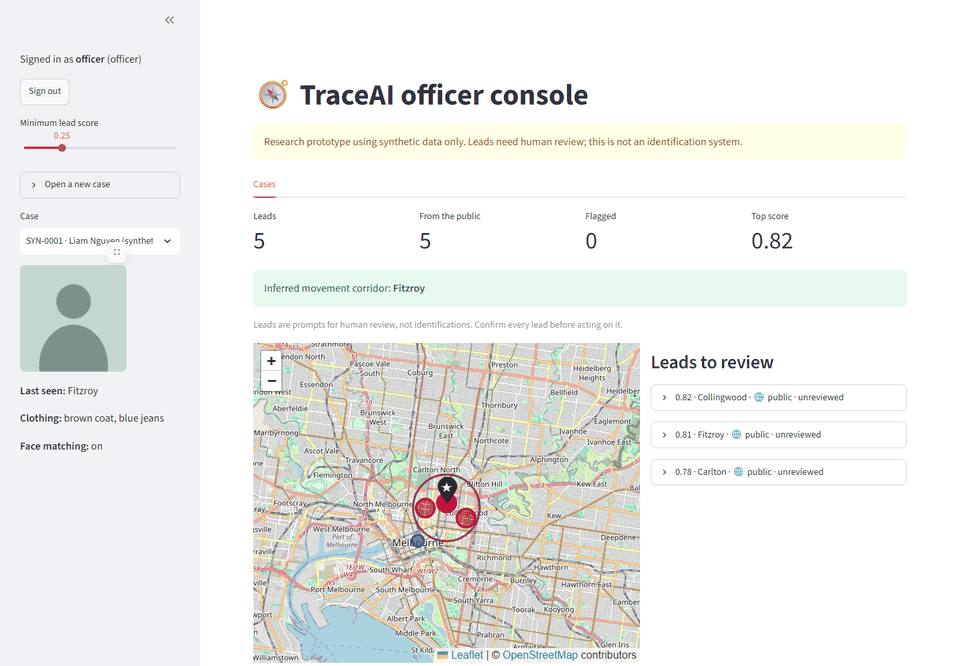
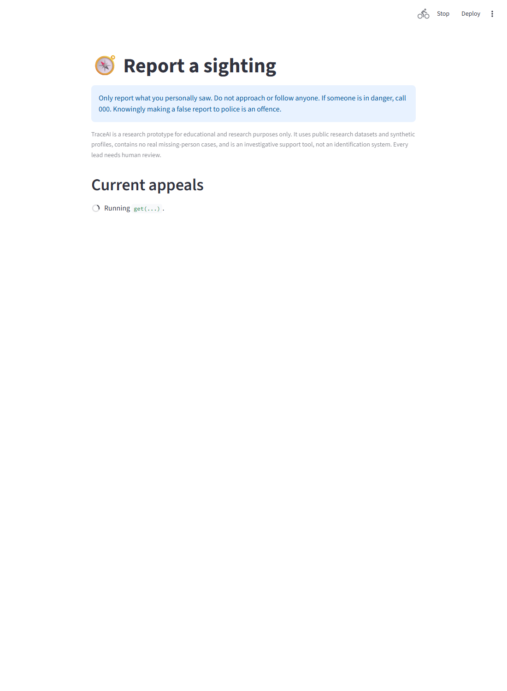
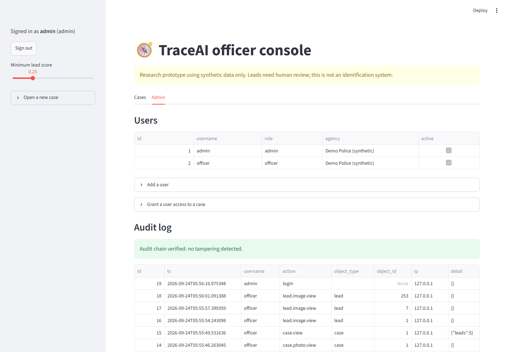
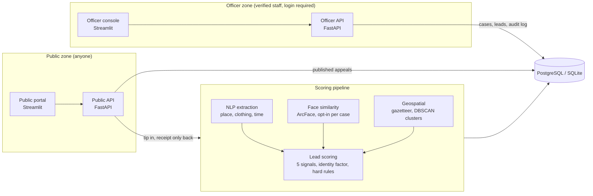

# TraceAI

[](https://github.com/GopikaJaideep/TraceAI/actions/workflows/ci.yml)

AI-assisted missing-person investigation **support** platform for Australian contexts. **Police and
partner agencies** review and prioritise leads; **the general public** can only read published appeals and
submit tips.

**[Live demo](https://gopikajaideep.github.io/TraceAI/)** · **[Design decisions and ethics](docs/design-decisions.md)** · [Results](#results)

> **Research prototype.** Public research datasets and synthetic profiles only. No real cases, no real
> CCTV or personal data. It is an investigative support tool, not an identification system. Do not point it
> at real data until the "Before real use" list below is done.



| Public portal | Admin and audit log |
|---|---|
|  |  |

Screenshots use placeholder avatars: the test photos (LFW) are real people, so they are never published.

## Architecture



The two zones are **separate processes**: the public app does not contain the officer routes at all, so it
cannot leak them through a bug or misconfiguration.

| | Public zone | Officer zone |
|---|---|---|
| Who | Anyone | Verified police / NGO staff |
| App | `traceai.api.public_app` (8020) + `public_portal/` (8502) | `traceai.api.officer_app` (8010) + `dashboard/` (8501) |
| Can do | Read appeals an officer published; submit a tip | Open and close cases, review leads, see the map, manage users (admin) |
| Sees | City-level location, photo and summary an officer chose to publish | Only the cases they were granted |
| Gets back from a tip | A random receipt reference. Never a score, a match or a case | Ranked leads with a per-signal breakdown |

## How leads are scored

| Module | Approach |
|---|---|
| Vision | InsightFace / ArcFace embeddings, cosine similarity between a case photo and a tip photo |
| NLP | Extracts place (Australian gazetteer), clothing and time from free text; optional spaCy NER; hedging and certainty cues feed credibility |
| Geospatial | DBSCAN (haversine) clusters of strong sightings and an inferred movement corridor |
| Lead scoring | Weighted image, description, proximity, recency and credibility. Missing signals are dropped and weights renormalised. Identity evidence (face or description) scales the result. Impossible journeys and sightings that predate the last-known time score 0 |

## Results

`python -m scripts.evaluate` ranks 42 sightings per case, of which 3 are true sightings of that case's
person (a different photo of the same identity, degraded to mimic another camera). Random ordering gets
precision@3 of about 0.07. 30 cases per setting, InsightFace `buffalo_sc`.

**Standard setting**: decoys wear a different outfit or hedge their wording.

| Ranking method | Precision@3 | Top-1 correct | MRR | AUROC |
|---|---|---|---|---|
| Random ordering (expected value) | 0.07 ± 0.01 | 0.07 | 0.21 | 0.50 |
| Proximity to last-known place only | 0.64 ± 0.23 | 0.63 | 0.81 | 0.97 |
| Text, place, time and credibility (no face) | 0.98 ± 0.08 | 1.00 | 1.00 | 1.00 |
| Face similarity only | 0.68 ± 0.06 | 1.00 | 1.00 | 0.83 |
| **TraceAI: all signals fused** | **0.99 ± 0.06** | 1.00 | 1.00 | 1.00 |

The standard setting is too easy: the report templates and the extraction rules were written together, so
text alone is nearly perfect and fusion adds almost nothing. It cannot show what combining signals is for.

**Hard setting** (`--setting hard`): decoys match the outfit, area and confident wording of true sightings,
so only the face separates them.

| Ranking method | Precision@3 | Top-1 correct | MRR | AUROC |
|---|---|---|---|---|
| Random ordering (expected value) | 0.07 ± 0.01 | 0.07 | 0.21 | 0.50 |
| Proximity to last-known place only | 0.63 ± 0.25 | 0.67 | 0.81 | 0.97 |
| Text, place, time and credibility (no face) | 0.52 ± 0.25 | 0.40 | 0.65 | 0.96 |
| Face similarity only | 0.68 ± 0.06 | 1.00 | 1.00 | 0.83 |
| **TraceAI: all signals fused** | **0.96 ± 0.11** | 0.97 | 0.98 | 1.00 |

**How to read this honestly.** When text cannot separate the candidates, text-only ranking falls from 0.98
to 0.52, and the face signal alone is capped near 0.67 because only 2 of each person's 3 true sightings
carry a photo. Fusing the signals recovers 0.96. That is the case for combining them. Two things keep it
from being a real-world claim:

- **The benchmark favours fusion.** Every decoy carries a photo, but one of each person's true sightings
  does not. Mismatched faces push decoys down while the photo-less true sighting is not penalised. Real
  tips will mostly have no photo.
- **It is synthetic throughout.** Frontal photos of public figures, not CCTV; reports and extraction rules
  written together; only 30 cases per setting, so gaps of a few points are noise.

Numbers are also on the [demo site](https://gopikajaideep.github.io/TraceAI/#results) and in
`docs/eval.json`. Do not read any row as real-world accuracy.

## Misuse safeguards (what the code enforces)

| Risk | Control | Where |
|---|---|---|
| Stalking a person who fled an abuser, via a "missing" report | Cases only from an officer, with a police reference **and** a family-violence / protection-order screening attestation; the public never searches, sees matches or sees exact locations | `cases.create_case`, `public_app` |
| Someone probing the tip form to locate a person | Tip response is a receipt only; tipsters are never told whether anything matched | `public_app.submit_tip` |
| Fake or malicious tips | Rate limits (5 per 10 min, 20 per day per source), consent + false-report notice, honeypot field, tips from one source (3+ in 24 h) or identical text from several sources are **flagged** for reviewers; a tip never triggers action, it only joins a review queue | `public_app`, `ratelimit` |
| Malicious uploads / location leaks | Files are verified as real JPEG/PNG, decompression-bomb limited, size limited, re-encoded (EXIF and GPS dropped) and stored under random names | `images.store_image` |
| Insider snooping | Need-to-know per case (other officers and even admins get 404), every read and change logged in a hash-chained audit log, reading the audit log is itself logged | `security.case_for_user`, `audit` |
| Weak accounts | scrypt password hashing, 12+ character minimum, lockout after 5 failures, one message for every login failure, login rate limit, expiring signed tokens, no default credentials (the seed script prints random ones once) | `security` |
| Face-matching abuse | Off unless the officer attests the photo was lawfully obtained; a tip's photo is only turned into a face embedding if at least one open case has matching authorised; results are similarity scores for human review, never names | `cases`, `pipeline` |
| Data kept forever | Closing a case deletes its photo, face embedding and leads; public tips expire after 90 days unless an officer marked one useful (`python -m scripts.purge`) | `cases.close_case`, `purge_expired_tips` |
| Source tracing | Tipster IPs are stored only as a keyed hash, never raw | `security.source_hash` |

The reasoning, the alternatives I rejected and the risks I could not remove are in
[docs/design-decisions.md](docs/design-decisions.md).

## Before real use (not done, and not something code alone can do)

- **Legal and privacy:** biometric data is sensitive information under the Privacy Act 1988; get a privacy
  impact assessment and legal advice, and agree governance with the police agency that owns the cases.
- **Identity:** replace the built-in login with the agency's SSO and MFA. Verify tipsters' phone or email if
  you want stronger fake-report resistance.
- **Infrastructure:** TLS everywhere, the officer zone reachable only from the agency network/VPN, a WAF or
  edge rate limiter (the built-in limiter is per process), encryption at rest, backups, and a real
  `X-Forwarded-For` policy behind your proxy.
- **Audit:** ship the audit log to write-once storage. The hash chain detects edits; it cannot stop someone
  with database admin rights from rewriting the whole chain.
- **Accuracy and fairness:** measure face-matching and lead-ranking error rates, including across
  demographic groups, on data that resembles reality.
- **Assurance:** independent security testing and an ethics review.

## Run locally

```bash
python -m venv .venv
.venv/Scripts/pip install -r requirements.txt insightface   # Windows; use .venv/bin on Linux/macOS
.venv/Scripts/python -m spacy download en_core_web_sm

# Seed synthetic data (first run downloads LFW, ~230 MB, and the face model). Prints login credentials once.
TRACEAI_FACE_MODEL=buffalo_sc .venv/Scripts/python -m scripts.seed --reset

export TRACEAI_SECRET_KEY=$(python -c "import secrets;print(secrets.token_urlsafe(48))")
TRACEAI_FACE_MODEL=buffalo_sc .venv/Scripts/python -m uvicorn traceai.api.officer_app:app --port 8010
.venv/Scripts/python -m uvicorn traceai.api.public_app:app --port 8020
TRACEAI_API_URL=http://localhost:8010 .venv/Scripts/python -m streamlit run dashboard/app.py --server.port 8501
TRACEAI_PUBLIC_API_URL=http://localhost:8020 .venv/Scripts/python -m streamlit run public_portal/app.py --server.port 8502
```

- Officer console: http://localhost:8501 (sign in with the seeded `officer` or `admin` credentials).
- Public portal: http://localhost:8502.
- If `TRACEAI_SECRET_KEY` is unset a throwaway key is used and sessions end whenever the API restarts.
- `TRACEAI_FACE_MODEL`: `buffalo_l` (default, most accurate, ~280 MB) or `buffalo_sc` (~15 MB).
- `TRACEAI_FACE_BACKEND=none` disables image scoring. `DATABASE_URL` defaults to SQLite in `data/`.
- Changing the schema needs `--reset` (there are no migrations yet), which wipes the database.

## Docker

```bash
POSTGRES_PASSWORD=... TRACEAI_SECRET_KEY=... docker compose up --build
```

Public services are published on 8020 and 8502; officer services bind to `127.0.0.1` only. The
[CI workflow](.github/workflows/ci.yml) builds the images and smoke-tests the whole stack against
PostgreSQL on every push: all four services come up, the zone boundaries hold (officer routes return 401
without login and do not exist on the public app), and a case, a public tip and the officer's analysis
round-trip through the database. If you would rather not use Docker, the manual path above works.

## Tests and CI

```bash
.venv/Scripts/python -m pytest -q tests           # 48 tests, through the real HTTP layer
.venv/Scripts/python -m scripts.mutation_check    # breaks 10 safeguards one at a time; the tests must fail each time
```

CI runs the tests on Python 3.11 and 3.13, runs `mutation_check` (so "each safeguard was verified by
breaking it" is reproducible rather than a claim), and runs the Docker smoke test.

## Reproducing the screenshots and results

```bash
python -m scripts.evaluate --seeds 5 --setting standard   # and --setting hard
python -m scripts.export_demo                             # data for the demo site
python -m scripts.make_screenshot_data                    # photo-free database copy
python -m scripts.capture_screenshots                     # needs: pip install playwright
```

## Limitations

- The gazetteer is about 50 well-known places with approximate coordinates, not the full OpenStreetMap or
  ASGS extracts. `gazetteer.resolve` and `nearest` are the interface a full version would keep.
- Market-1501 is not used (it needs a Kaggle login). Cross-camera sightings are simulated by augmenting
  LFW images.
- Lead scores are heuristic and uncalibrated. Weights are in `traceai/scoring.py`.
- The Streamlit public form has no honeypot field (the API supports one for custom front ends).
- No database migrations; no MFA; in-memory rate limits.

## Data

Faces: [LFW](https://www.kaggle.com/datasets/jessicali9530/lfw-dataset) via scikit-learn. All profile
details (names, ages, clothing, last-known places, police references) are invented.
